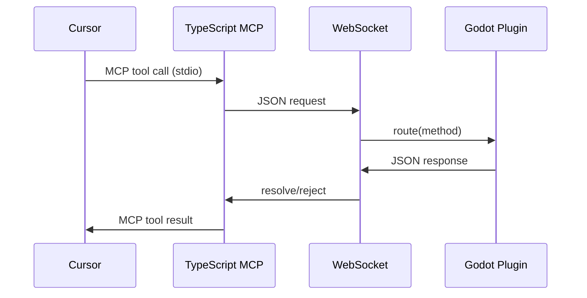

# Wire Protocol

JSON request/response messages over a **persistent WebSocket** between the TypeScript MCP server and the Godot editor plugin.

- **Default URL:** `ws://127.0.0.1:6505`
- **Port override:** set `GODOT_MCP_PORT` in both environments (Node + Godot reads `OS.get_environment`).

## Request

```json
{
  "id": "unique-id",
  "method": "tool_name",
  "params": {}
}
```

| Field | Type | Required | Description |
|-------|------|----------|-------------|
| `id` | string | yes | Correlates response; UUID recommended |
| `method` | string | yes | Tool name (snake_case) |
| `params` | object | no | Tool-specific arguments |

## Success response

```json
{
  "id": "same-id",
  "ok": true,
  "result": {}
}
```

## Error response

```json
{
  "id": "same-id",
  "ok": false,
  "error": {
    "code": "ERROR_CODE",
    "message": "Human-readable error",
    "suggestion": "Concrete next step",
    "details": {}
  }
}
```

## Error codes

| Code | Meaning |
|------|---------|
| `GODOT_NOT_CONNECTED` | WebSocket down (TS side) or internal bridge error |
| `TIMEOUT` | No response within `GODOT_MCP_TIMEOUT_MS` (default 30000) |
| `INVALID_PARAMS` | Malformed JSON or invalid tool arguments |
| `NOT_FOUND` | Node, file, resource, or tool not found |
| `ALREADY_EXISTS` | Create conflict |
| `UNSUPPORTED_NODE_TYPE` | Node class not supported for operation |
| `UNSUPPORTED_RESOURCE_TYPE` | Resource type not supported |
| `GODOT_API_ERROR` | Godot API returned failure |
| `SCRIPT_ERROR` | Script parse/compile error |
| `SCENE_ERROR` | Scene load/save/instantiate error |
| `RUNTIME_NOT_RUNNING` | Game not in play mode |
| `PERMISSION_DENIED` | Operation not allowed |
| `DANGEROUS_TOOL_DISABLED` | Dangerous tool blocked by policy |
| `NOT_IMPLEMENTED` | Tool known but not implemented yet |
| `INTERNAL_ERROR` | Unexpected plugin/server error |

## Transport rules

1. **Text frames only** — JSON UTF-8 strings; binary frames rejected.
2. **One response per request** — matched by `id`.
3. **127.0.0.1 only** — Godot listens on localhost; not exposed to LAN by default.
4. **Logging** — both sides log tool name + id; never log secrets.

## MCP layer

The TypeScript server exposes tools to Cursor via **stdio MCP**. Each MCP tool handler:

1. Validates input (Zod).
2. Sends a WebSocket request to Godot.
3. Returns `result` as formatted JSON text, or `isError: true` with structured error JSON.

## Connection lifecycle



On disconnect, TypeScript schedules reconnect with backoff and returns `GODOT_NOT_CONNECTED` until the editor plugin is available again.
